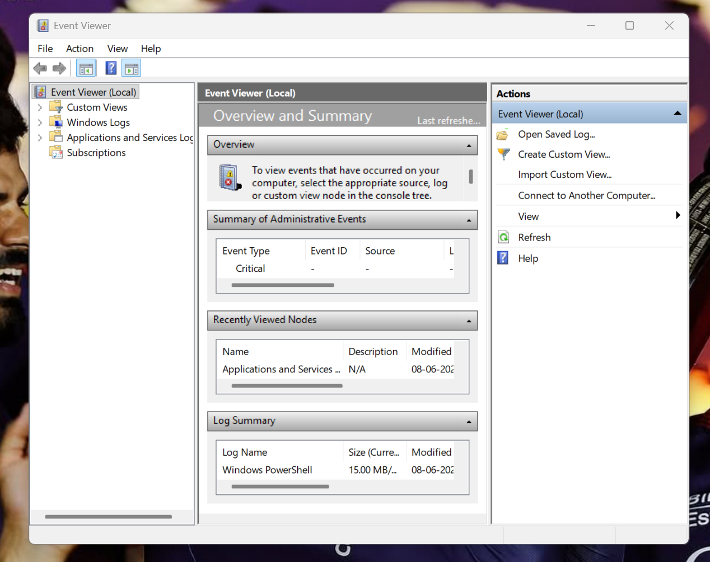
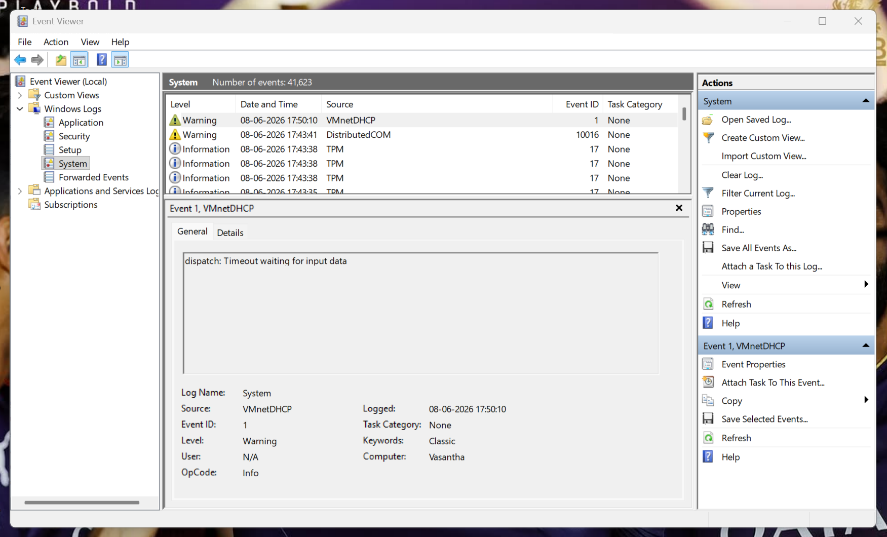
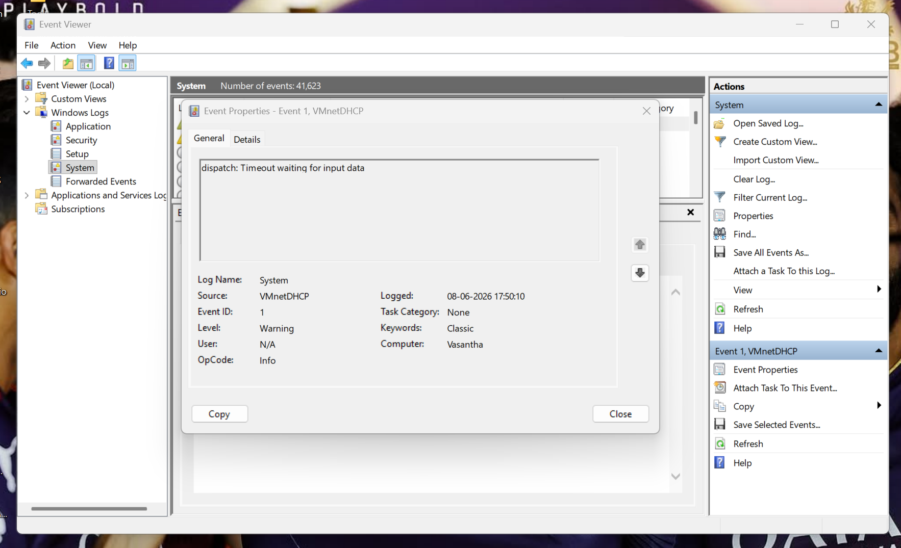
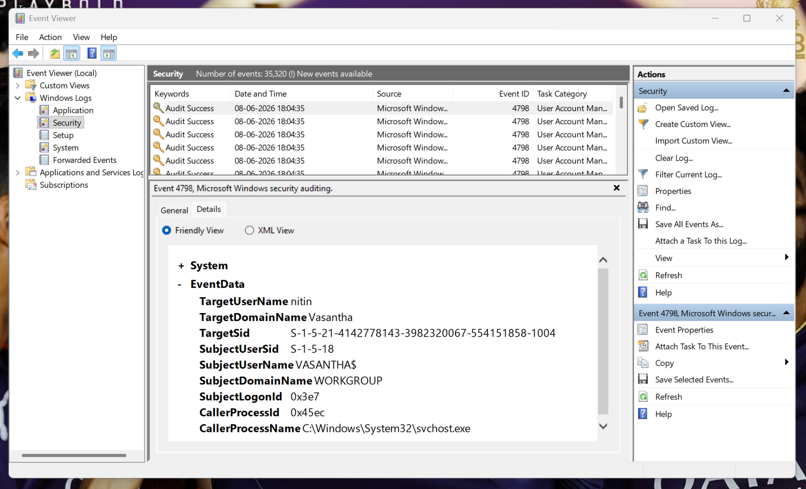
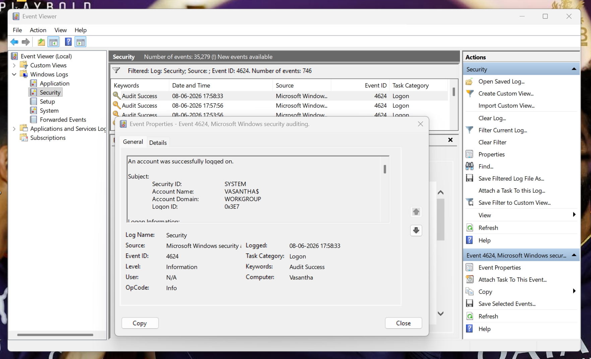
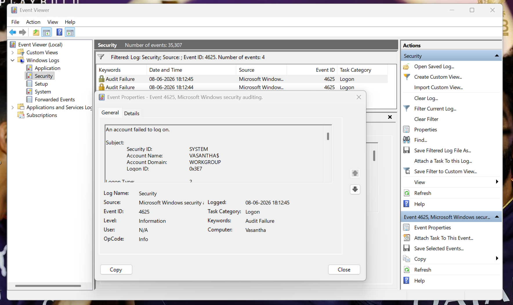
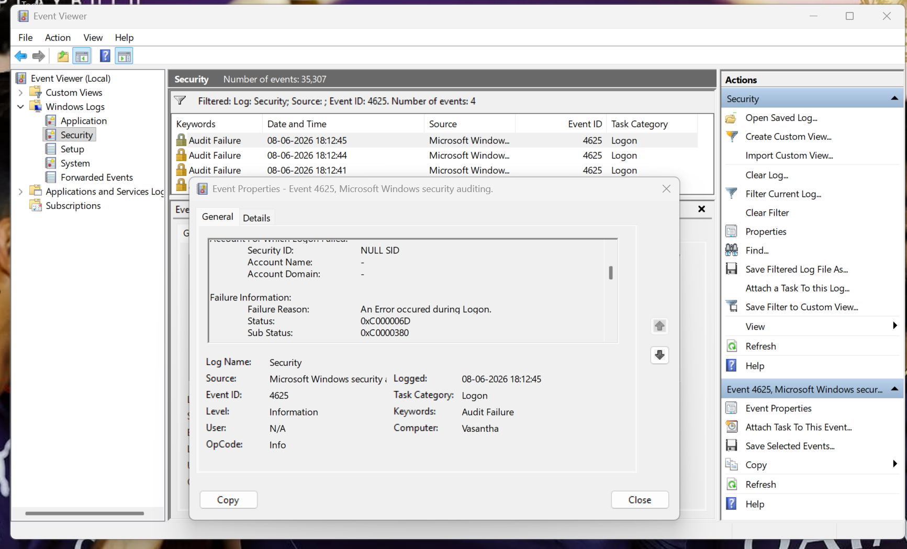
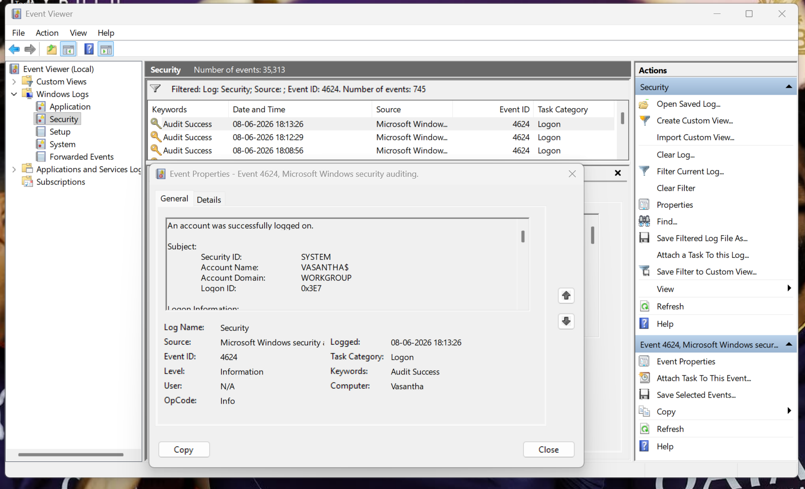

# Windows Event Log Security Analysis Lab

## Project Overview

This project demonstrates hands-on Windows Security Event Log analysis performed using Event Viewer to detect, investigate, and document authentication-related security events.

The investigation focused on identifying successful and failed authentication attempts, analyzing event details, correlating security events, and mapping findings to the MITRE ATT&CK framework using SOC analyst methodologies.

This project simulates a real-world Security Operations Center (SOC) investigation where analysts review Windows Security Logs to detect suspicious login activity, investigate authentication failures, and assess potential security risks.

---

## Project Objectives

* Access and analyze Windows Security Event Logs
* Investigate authentication-related events
* Identify successful and failed logon attempts
* Perform event filtering and event correlation
* Analyze authentication failures
* Document security findings
* Map observed activity to MITRE ATT&CK
* Develop practical SOC analyst investigation skills

---

# Skills Demonstrated

* Windows Event Log Analysis
* Security Monitoring
* Event Viewer Investigation
* Authentication Log Analysis
* Incident Investigation
* Event Correlation
* Threat Detection
* Risk Assessment
* Security Reporting
* MITRE ATT&CK Mapping
* SOC Analyst Methodology

---

# Tools Used

| Tool                   | Purpose                   |
| ---------------------- | ------------------------- |
| Windows Event Viewer   | Security Log Analysis     |
| Windows Security Logs  | Authentication Monitoring |
| Log Parser Studio      | Advanced Log Analysis     |
| MITRE ATT&CK Framework | Threat Mapping            |

---

# Project Architecture

```text
Windows Security Logs
          │
          ▼
     Event Viewer
          │
          ▼
 Authentication Analysis
          │
          ▼
 Event Correlation
          │
          ▼
 Security Findings
          │
          ▼
 MITRE ATT&CK Mapping
          │
          ▼
 Incident Report
```

---

# Investigation Workflow

## Step 1 – Access Event Viewer

Opened Windows Event Viewer and reviewed available logs.

### Screenshot



---

## Step 2 – Review System Logs

Analyzed Windows System Logs to understand operating system events and system activity.

### Screenshot



---

## Step 3 – Analyze System Event Details

Reviewed event details including Event ID, Source, Timestamp, and Description.

### Screenshot



---

## Step 4 – Review Security Logs

Accessed Windows Security Logs to investigate authentication activity.

### Screenshot



---

## Step 5 – Investigate Successful Logons

Filtered Security Logs for:

```text
Event ID: 4624
```

Purpose:

* Track successful authentication
* Validate user access
* Monitor account activity

### Screenshot



---

## Step 6 – Investigate Failed Logons

Filtered Security Logs for:

```text
Event ID: 4625
```

Purpose:

* Detect unauthorized access attempts
* Investigate password guessing
* Monitor authentication failures

### Screenshot



---

## Step 7 – Analyze Authentication Failure Details

Investigated failure reasons and authentication status codes.

### Evidence Collected

| Field       | Value                  |
| ----------- | ---------------------- |
| Event ID    | 4625                   |
| Status Code | 0xC000006D             |
| Description | Authentication Failure |

### Screenshot



---

## Step 8 – Event Correlation Analysis

Correlated authentication events to reconstruct user activity.

### Timeline

| Time     | Event ID | Description      |
| -------- | -------- | ---------------- |
| 18:12:41 | 4625     | Failed Logon     |
| 18:12:44 | 4625     | Failed Logon     |
| 18:12:45 | 4625     | Failed Logon     |
| 18:13:26 | 4624     | Successful Logon |

### Correlation Pattern

```text
4625 → Failed Logon
4625 → Failed Logon
4625 → Failed Logon
4624 → Successful Logon
```

### Screenshot



---

# Security Findings

## Finding 1 – Repeated Failed Authentication Attempts

### Event ID

4625

### Severity

Medium

### Description

Multiple failed authentication attempts were identified within a short timeframe.

### Potential Risks

* Password Guessing
* Credential Attacks
* Unauthorized Access Attempts

---

## Finding 2 – Successful Authentication After Failures

### Event ID

4624

### Severity

Low

### Description

A successful authentication event occurred after several failed login attempts.

### Potential Risks

* Credential Validation
* Password Guessing Success
* User Authentication Errors

---

# MITRE ATT&CK Mapping

| Technique         | ATT&CK ID |
| ----------------- | --------- |
| Brute Force       | T1110     |
| Password Guessing | T1110.001 |
| Valid Accounts    | T1078     |

---

## T1110 – Brute Force

Adversaries may attempt to gain access by systematically trying passwords against one or more accounts.

### Evidence

Multiple Event ID 4625 entries identified.

---

## T1110.001 – Password Guessing

Adversaries attempt to guess passwords for valid user accounts.

### Evidence

Repeated failed authentication attempts detected.

---

## T1078 – Valid Accounts

Adversaries may use valid credentials to gain access to systems and services.

### Evidence

Successful Event ID 4624 authentication observed.

---

# Risk Assessment

| Category             | Risk          |
| -------------------- | ------------- |
| Authentication Abuse | Medium        |
| Account Compromise   | Low           |
| Privilege Escalation | Low           |
| Malware Activity     | None Observed |
| Overall Risk         | Low           |

---

# Recommendations

### Authentication Security

* Enable Multi-Factor Authentication (MFA)
* Enforce strong password policies
* Implement password complexity requirements
* Configure account lockout policies

### Monitoring Improvements

* Monitor Event IDs 4624 and 4625
* Configure authentication alerts
* Centralize logs in a SIEM platform
* Implement threat detection dashboards

### Account Security

* Review inactive accounts
* Audit privileged accounts
* Monitor unusual authentication patterns


---

# Documentation

| File                                  | Description                       |
| ------------------------------------- | --------------------------------- |
| Project-Overview.md                   | Project Summary                   |
| Event-ID-Reference.md                 | Security Event Reference          |
| Investigation-Workflow.md             | Investigation Process             |
| MITRE-ATTACK-Mapping.md               | ATT&CK Technique Mapping          |
| Security-Findings.md                  | Investigation Findings            |
| Incident-Summary.md                   | Executive Incident Summary        |
| Windows-Event-Log-Analysis-Report.pdf | Detailed SOC Investigation Report |

---

# Learning Outcomes

Through this project, I gained practical experience in:

* Windows Security Monitoring
* Authentication Event Investigation
* Log Analysis
* Event Correlation
* Threat Detection
* Incident Documentation
* MITRE ATT&CK Mapping
* SOC Analyst Investigation Workflows

---

# Author

**Nitin Sukthe**

Future SOC Analyst | Future Cloud Security Engineer

Focused on Security Monitoring, Threat Detection, Incident Response, Cloud Security, and Defensive Security Operations.
